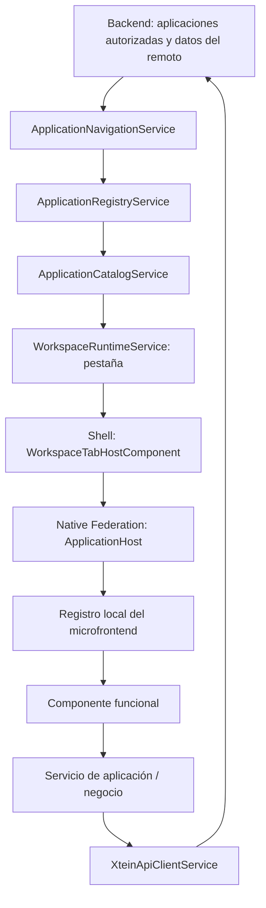

# Arquitectura y referencia para migraciones desde Legacy

Revisión estática: 2026-09-25. Este documento describe el código encontrado, no certifica paridad funcional ni funcionamiento contra el backend. El [inventario de aplicaciones y objetos](inventario-aplicaciones.md) complementa este mapa con declaraciones, campos, métodos públicos y enlaces al código.

## Organización del repositorio

```text
apps/
  shell/                 Entrada, autenticación, menú, pestañas y toolbar
  mfe-adm/               ADM-015 y ADM-300
  mfe-mad/               MAD-001, MAD-002 y MAD-005
  mfe-mcom/              VEN-209, VEN-212, VEN-229 y VEN-230
  mfe-dashboard/         Visor común de dashboards según applicationId
  mfe-inv/               Infraestructura con registro vacío
  mfe-malm/              Infraestructura con registro vacío
  mfe-mcpr/              Infraestructura con registro vacío
  mfe-men/               Infraestructura con registro vacío
  mfe-mfin/              Infraestructura con registro vacío
  mfe-mthu/              Infraestructura con registro vacío
libs/                    Ocho bibliotecas compartidas
Legacy/                  Aplicación anterior con configuración propia
tools/application-generator/  Generador de aplicaciones y plantillas
docs/                    Referencias de arquitectura y objetos
```

El workspace usa Angular 21.2.22 según `package.json`, TypeScript 5.9 y Native Federation. El README raíz conserva referencias a Angular CLI 15; no representa la configuración actual. No es un workspace Nx: los proyectos se definen en `angular.json`.

## Cómo se abre una aplicación



El catálogo valida que la aplicación exista, esté activa y tenga un remoto habilitado. **La pertenencia a un microfrontend viene del backend; no se deduce del prefijo del código.** Por eso las aplicaciones VEN están hoy dentro de `mfe-mcom`.

Hay dos registros distintos: el global contiene los metadatos autorizados del backend; el local `*-application.registry.ts` relaciona `applicationId` con un import dinámico del componente. Para abrir una aplicación hacen falta ambos y una configuración de federación válida. El Shell carga `./ApplicationHost`, crea su componente y le pasa `applicationId`.

`mfe-dashboard` es una excepción: su host dirige los códigos recibidos a un visor compartido, sin una entrada estática por dashboard. `MAD-002` permite trabajar con el árbol y tipos diseñables `DASHBOARD`, `KPI` y `KPIPANEL`.

Referencias: [catálogo](../libs/runtime/src/lib/applications/application-catalog.service.ts), [host del Shell](../apps/shell/src/app/workspace/workspace-tab-host/workspace-tab-host.component.ts), [registro MCOM](../apps/mfe-mcom/src/app/applications/mcom-application.registry.ts).

## Responsabilidad de las bibliotecas

| Biblioteca | Responsabilidad encontrada |
| --- | --- |
| `@xtein/sdk` | Contratos de aplicación, remoto, navegación, pestaña y toolbar; estados, permisos, capacidades y construcción del estado de botones. |
| `@xtein/runtime` | Registro y resolución de aplicaciones, workspace, estado y comandos de toolbar, adaptación de permisos del backend. |
| `@xtein/api-client` | Transporte HTTP y envoltura del protocolo existente; contexto autenticado y actualización del token recibido. |
| `@xtein/session` | Contexto de usuario/empresa, almacenamiento, actividad, caducidad y coordinación entre pestañas del navegador. |
| `@xtein/auth` | Login, guards, validación y recuperación/cambio de contraseña. |
| `@xtein/logging` | Contextos, interceptación HTTP, errores, sanitización y cola de registros. |
| `@xtein/ui` | Controles de formulario, grillas, gráficos, scheduler, popups, notificaciones, filtros, vistas, reportes, settings y componentes de dashboard. |
| `@xtein/dashboard-runtime` | Datos y configuración de dashboards, runtime, iconos y extensiones. |

Los imports públicos se exponen mediante `src/public-api.ts`. Los alias `@xtein/*` de `tsconfig.json` apuntan a `dist`, por lo que los cambios de bibliotecas requieren recompilación antes de consumirlos en aplicaciones. `npm run build:libs` define el orden actual. La federación comparte bibliotecas de estado como singletons; perder esa configuración puede separar la sesión o la toolbar del Shell y del remoto. DevExtreme/DevExpress se excluyen del intercambio en la configuración revisada de MCOM y se empaquetan localmente.

## Estructura y objetos de una aplicación

```text
apps/mfe-<dominio>/src/app/
  application-host/                Punto de entrada federado
  applications/
    <dominio>-application.registry.ts
    <codigo>/
      <codigo>.component.ts        Estado y coordinación de pantalla
      <codigo>.component.html      Vista
      <codigo>.component.scss      Estilos
      constants/
        <codigo>.constants.ts      Identidad, endpoints y acciones
        <codigo>-ui.constants.ts   Defaults y configuración visual
        <codigo>-logging.constants.ts
        <codigo>-catalog.constants.ts     Cuando hay catálogos
        <codigo>-electronic.constants.ts  Cuando aplica
      models/                      Entidades, detalles y payloads
      services/
        <codigo>.service.ts        Acceso a API
        <codigo>-business.service.ts      Cuando hay orquestación adicional
      components/                  Subvistas, cuando existen
      utils/                       Funciones específicas, cuando existen
  models/                          Contrato de registro en varios remotos
```

No todas las aplicaciones tienen todas las carpetas. MAD define también su contrato de registro dentro del propio registry. ADM-300 organiza objetos específicos del tablero. El generador proporciona una base, con operaciones que aún deben implementarse; no produce automáticamente una aplicación funcional completa.

Los objetos usuales son:

- `XxxApplication`: identidad funcional, identificador de backend y clave de tabla/payload cuando corresponde.
- `XxxEndpoint`, `XxxAction`, `XxxCatalog`: rutas, acciones y consultas auxiliares. No asumir que todas usan las mismas acciones CRUD.
- `XxxRecord` y modelos de detalle: contratos de datos. Mantienen nombres del backend, frecuentemente en mayúsculas, con tipos explícitos y campos opcionales.
- Modelos de negocio: payloads de guardado/borrado, criterios de filtro, catálogos, resultados de impuestos y configuración.
- Defaults, capacidades de toolbar y opciones de UI: configuración separada del componente.
- Servicio API: usa `XteinApiClientService`. En aplicaciones complejas, el servicio de negocio decodifica respuestas, arma payloads y coordina operaciones.
- Componente standalone: mantiene formulario, registros, selección, modo, carga y ventanas; consume controles compartidos y publica estado de toolbar.

## Aplicaciones presentes y entidades principales

| Remoto / aplicación | Objetos y propósito | Referencia Legacy identificada |
| --- | --- | --- |
| MAD / `MAD-001` | `Mad001ApplicationRecord`, aplicaciones padre, unidades y listas; clave `APLICACIONES_ASOCIADAS`. | No se identificó carpeta homónima bajo `Legacy/src/app/modulos`; buscar por acción/entidad si se migra lógica relacionada. |
| MAD / `MAD-002` | `Mad002ApplicationNode`; árbol y acceso al diseño de dashboards/KPI. | No se identificó carpeta homónima. |
| MAD / `MAD-005` | `Mad005DataSourceConfiguration`, tipo de origen y listas; clave `CONFIG_ORIGEN_DATO`. | No se identificó carpeta homónima. |
| ADM / `ADM-015` | Usuarios, autorizaciones, permisos especiales, UN asociadas, conexiones y settings; payloads de guardado y contraseña. | `modulos/ADM015`, `services/ADM015`. |
| ADM / `ADM-300` | `TableroControlsContext`, `TableroPurchase`, opciones de controles y datos de demostración. | `containers/tablero`. Los datos demo no representan métricas en vivo. |
| MCOM / `VEN-209` | Cliente, direcciones, teléfonos, emails, contactos, condiciones y payloads; clave `CLIENTES`. | `modulos/VEN209`, incluidos subcomponentes; `services/VEN209`. |
| MCOM / `VEN-212` | Factura, ítems, pagos, gravámenes, presentaciones, IVA y documento electrónico; clave `FACTURA`. | `modulos/VEN212`; seguir el import real de `VEN155Service`. |
| MCOM / `VEN-229` | Pedido, ítems, pagos, gravámenes y catálogos; clave `Pedido` con esa capitalización. | `modulos/VEN229`; revisar imports del componente para servicios reales. |
| MCOM / `VEN-230` | Prefactura, ítems, pagos, gravámenes, listas, selección y documento electrónico; clave `PREFACTURA`. | `modulos/VEN230`; revisar imports del componente para servicios reales. |
| Dashboard / código recibido | `XteinDashboardApplicationComponent` reutiliza el visor y registra permisos/toolbar por aplicación. | Dashboards en `modulos/MEN`, entre otras referencias a revisar por código. |

`VEN-012` está registrado como alias de `VEN-212`; no representa otro componente de negocio. Hay nueve carpetas de aplicaciones específicas y una implementación genérica de dashboard. La presencia en un registro no demuestra que la migración esté terminada.

El inventario adjunto enumera 260 declaraciones exportadas dentro de `applications`, con miembros directos de clases/interfaces y referencias a los archivos. Incluye además las carpetas de módulos Legacy y sus declaraciones de modelos `*.class.ts`. No es un inventario de tablas SQL ni de todas las instancias creadas dinámicamente.

## Estado de pantalla y protocolo de backend

Cada aplicación publica su `ToolbarState` mediante `createRecordToolbarState`, combinando modo, capacidades, permisos, carga y posición del registro. Los modos son `initial`, `browsing`, `creating`, `editing` y `copying`. Los comandos se reciben con `commandsForApplication(applicationId)`, para mantener aisladas las pantallas abiertas. El workspace conserva pestaña activa y estado `dirty`; los cambios de formulario deben sincronizar ese estado y la cancelación debe restaurar los datos pertinentes. Las suscripciones se liberan al destruir el componente.

El cliente API envía POST con `prmAccion`, `prmDatos` serializado y datos de conexión. En llamadas autenticadas añade empresa, usuario y token desde `SessionService`; una respuesta con `token` puede actualizar la sesión. Los servicios funcionales no necesitan reproducir esta envoltura.

El contenido de `response.data` puede ser JSON serializado. Las aplicaciones revisadas también interpretan `ErrMensaje` como error de negocio. Conservar la envoltura, nombres, capitalización, estructuras anidadas y conversiones existentes es parte de la migración: una respuesta HTTP exitosa por sí sola no demuestra éxito funcional. VEN-212, por ejemplo, contempla variantes como `ITM_Factura` e `ITM_FACTURA`; no normalizarlas sin contrastar el contrato.

## Legacy y procedimiento para migrar una funcionalidad

`Legacy/src/app` separa `modulos`, `services`, `shared`, `containers`, `views` y `directives`. Mantiene `app.module.ts` y rutas, pero también contiene componentes standalone. Los modelos suelen estar en `cls<codigo>.class.ts`; hay módulos con múltiples subpantallas, variantes `UP` y servicios dentro de la propia carpeta. No basta con copiar el componente principal.

Equivalencias de responsabilidad para orientar el trabajo, no sustituciones mecánicas:

| Dependencia anterior | Destino habitual |
| --- | --- |
| `SbarraService`, `clsBarraRegistro` | Toolbar runtime, permisos y contratos SDK. |
| `TabService` y contenedores de pestañas | `WorkspaceRuntimeService` y workspace del Shell. |
| `GlobalVariables` con datos de usuario/empresa | `SessionService`; identificar por separado otros valores globales. |
| Servicios HTTP que montan conexión/token | Servicio de aplicación sobre `XteinApiClientService`. |
| Filtro, vista rápida, reportes, settings | Controles y servicios correspondientes de `@xtein/ui`. |
| `cls...` con objetos de negocio | Modelos tipados, defaults y payloads locales. |
| Controles DevExtreme directos | Revisar primero los wrappers disponibles en `@xtein/ui`. |

Para cada migración:

1. Identificar el código solicitado, la pantalla y sus subcomponentes Legacy; seguir imports y eventos de la plantilla, no solo los nombres de carpetas.
2. Enumerar datos, defaults, validaciones, cálculos, estados, permisos, catálogos, reportes y efectos de cada acción. Compararlos con lo ya implementado en destino.
3. Registrar los endpoints, acciones y payloads reales, incluyendo claves, fechas, valores nulos y errores de negocio. No inferir tablas físicas a partir de `Table`.
4. Ubicar la lógica en modelos, constantes, servicio API, servicio de negocio y componentes según las convenciones de la aplicación destino; reutilizar infraestructura compartida.
5. Integrar permisos, toolbar, estado de cambios, cancelación y liberación de suscripciones. Verificar aislamiento al alternar pestañas.
6. Agregar el registro local si es una aplicación nueva. El generador en `tools/application-generator` imprime el cambio requerido pero **no modifica el registry**. Verificar también la asociación del backend con el remoto.
7. Compilar las bibliotecas afectadas y el remoto correspondiente; comprobar los flujos modificados y la paridad con Legacy. Validar contra backend cuando se disponga del entorno y datos de prueba necesarios.

## Alcance de esta revisión

Se revisaron configuración, registros, hosts, resolución de aplicaciones, contratos compartidos, cliente API, estructura de UI, generador, modelos exportados y ejemplos de servicios/componentes nuevos y Legacy. Se documentó el inventario estático, sin modificar lógica funcional ni ejecutar compilación, pruebas o consultas al backend. Las reglas de negocio de cada módulo Legacy deberán contrastarse en detalle al abordar su migración concreta.
